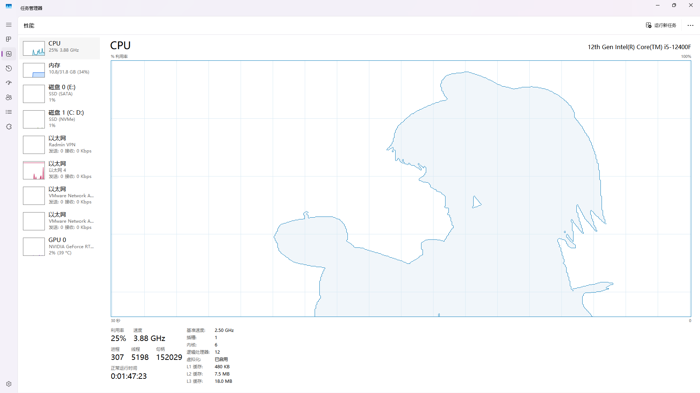

# TaskmgrPlayerASM



在任务管理器的性能标签页中播放视频，核心逻辑使用 x64 汇编重写。

## 项目简介 (Project Description)

TaskmgrPlayerASM 是一个基于 [svr2kos2/TaskmgrPlayer](https://github.com/svr2kos2/TaskmgrPlayer) 项目的衍生作品。原项目实现在 Windows 任务管理器的性能标签页中显示视频。

**TaskmgrPlayerASM 的主要特点在于，我们将原项目中的核心逻辑（如查找窗口、枚举子窗口、窗口判断、调试信息输出、主播放流程控制）大部分都移植并使用原生的 x64 汇编语言（MASM）进行了重写实现**，而保留了依赖于 OpenCV C++ API 的部分（如图像处理、视频读取、窗口显示）。

这个项目旨在探索汇编语言在 Windows 平台下的应用，理解低层级系统交互和调用约定 (x64 ABI)，并对比与高级语言实现的差异。

## 功能特性 (Features)

* 在 Windows 任务管理器的性能标签页中内嵌并播放视频。
* 核心窗口查找、判断和主流程控制逻辑由 x64 汇编实现。
* 利用 OpenCV 进行视频解码、图像处理 (二值化, 边缘检测) 和窗口显示。
* 支持播放指定视频文件 (如 BadApple.flv)。
* （如果保留了配置功能）支持通过配置文件 (`config.cfg`) 自定义显示颜色和网格。

## 构建 (Building)

本项目需要 MASM (ml64.exe) 和支持 C++11 或更高标准的 C++ 编译器 (如 Visual Studio 的 MSVC)。

1.  **克隆仓库：**
    ```cmd
    git clone [https://github.com/YourGitHubUsername/TaskmgrPlayerASM.git](https://github.com/YourGitHubUsername/TaskmgrPlayerASM.git)
    cd TaskmgrPlayerASM
    ```
    (如果你是创建了一个新的独立仓库，并且还没有上传，那么这步是给未来的用户看的。如果是 GitHub fork，链接会是你的 fork 地址)

2.  **准备 OpenCV：**
    * 下载并安装 OpenCV 库。
    * 配置你的编译环境，确保 C++ 编译器能找到 OpenCV 的头文件 (`include` 目录) 和库文件 (`lib` 目录)。

3.  **编译汇编文件：**
    * 使用 `ml64.exe` 编译所有的 `.asm` 文件到 `.obj` 文件。
    * 示例命令 (在开发者命令提示符中):
        ```cmd
        ml64.exe /c /Fo EnumChildWindowProc.obj EnumChildWindowProc.asm
        ml64.exe /c /Fo FindWnd.obj FindWnd.asm
        ml64.exe /c /Fo IsSmallerWindow.obj IsSmallerWindow.asm
        ml64.exe /c /Fo main.obj main.asm
        ml64.exe /c /Fo OutPutDbg.obj OutPutDbg.asm
        ml64.exe /c /Fo Play.obj Play.asm
        ```

4.  **编译 C++ 文件：**
    * 使用 C++ 编译器编译你的 `TaskmgrPlayer.cpp` 文件到 `.obj` 文件。
    * 示例命令 (需要正确设置包含目录以找到 OpenCV 头文件):
        ```cmd
        cl.exe /c /Fo TaskmgrPlayer.obj TaskmgrPlayer.cpp /I "path/to/opencv/include" /std:c++17 /EHsc
        ```
        (注意 `/std:c++17` 或 `/std:c++14` 等取决于你的代码是否使用了 C++11 以上特性，`/EHsc` 用于异常处理)

5.  **链接：**
    * 将所有的 `.obj` 文件链接成一个可执行文件 (`TaskmgrPlayerASM.exe`)。你需要链接 Windows API 库 (User32.lib, Kernel32.lib, Gdi32.lib, Advapi32.lib, Winmm.lib) 和 OpenCV 的库。
    * 示例命令 (需要正确设置库目录以找到 Windows SDK 库和 OpenCV 库):
        ```cmd
        link.exe EnumChildWindowProc.obj FindWnd.obj IsSmallerWindow.obj main.obj OutPutDbg.obj Play.obj TaskmgrPlayer.obj user32.lib kernel32.lib gdi32.lib advapi32.lib winmm.lib "path/to/opencv/lib/opencv_world<version>.lib" /OUT:TaskmgrPlayerASM.exe
        ```
        (请将 `<version>` 替换为你使用的 OpenCV 版本号)

## 运行 (Running)

1.  将编译生成的 `TaskmgrPlayerASM.exe` 可执行文件、所需的 OpenCV DLL 文件以及你想要播放的视频文件 (例如 `BadApple.flv`) 放在同一个目录下。
2.  运行 `TaskmgrPlayerASM.exe`。
3.  打开 Windows 任务管理器，并切换到“性能”标签页。程序应该会自动找到任务管理器窗口并在其中显示视频。
4.  （如果保留了配置功能）你可以在同一目录下放置一个 `config.cfg` 文件来调整显示设置。


```
许可协议 (License)
本项目遵循 GNU General Public License v3.0 许可协议。详情请参见项目根目录下的 https://www.google.com/search?q=LICENSE 文件。

本项目是基于 svr2kos2/TaskmgrPlayer (GPL-3.0 协议) 的衍生作品。

贡献 (Contributing)
欢迎对本项目提出建议或贡献代码。请通过 GitHub 的 Issue 或 Pull Request 功能进行交流。

致谢 (Acknowledgements)
本项目基于 svr2kos2 的 TaskmgrPlayer 原项目。非常感谢原作者的创意和初步实现。

感谢所有在项目开发过程中提供帮助和建议的朋友。

作者 (Author)
Idealend Bin - [你的 GitHub 主页链接或其他联系方式]
